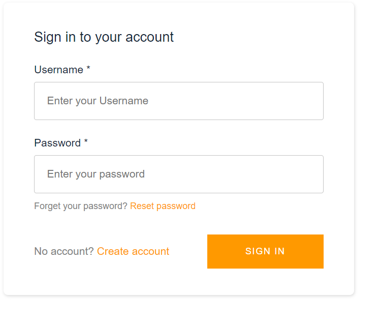
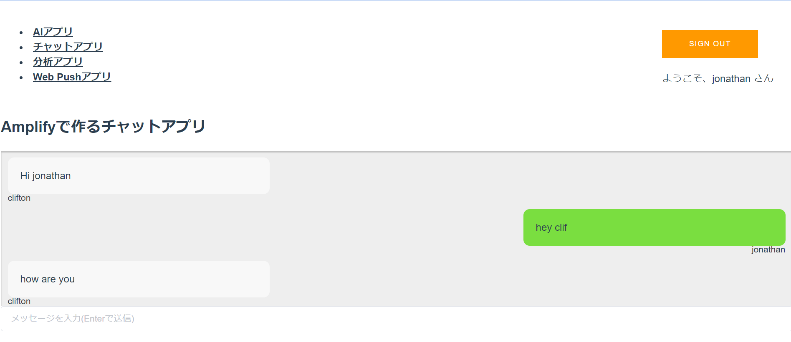

# AWS amplify handson
An AWS Amplify web app I built following an [official handson](http://educationhub-31789470-a146-11ea-85be-f18c4f5a36d8.s3-website-us-east-1.amazonaws.com/0_introduction.html).
The application includes: a user authentication function, live-chat function and can be hosted easily just by connecting the repository to AWS amplify using the console.

## Prerequisites
Must install the following 
```
npm  //10.x or above
node  // 5.x or above
amplify (installed by 'npm install -g @aws-amplify/cli@4.13.1')
```
Check the above by typing the following in your command line  
```
node -v 
npm -v  
amplify -v
```
*UNIX based command line is recommended  
  
## Project setup
To serve page locally 
```
cd aws-amplify-handson
npm install
npm run serve || amplify serve 
```

### User Authentication function
Signup, login, and logout is possible



### Live chat function
Looks pretty much like LINE, live chat is possible. Just create two users and you can start chatting!
  


#### Notes
I implemented the AI function partially, following the tutorial, but am stopping due to a [bug](https://github.com/aws-amplify/amplify-js/issues/3928).
Since this is a project I built for learning purposes, I've grasped what I can learn from the tutorial and might pick it up again when I want to build something similar. 
